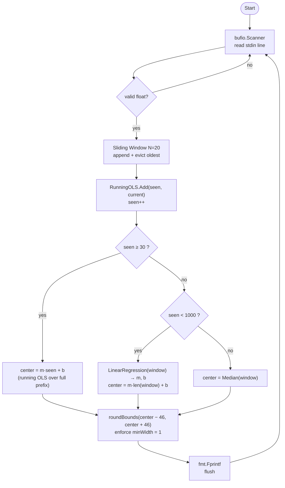

# PRD — Guess It 2

## 1. Problem Statement
**Context:** A real-time prediction engine that operates in a competitive environment, receiving a continuous stream of numbers via standard input.

**Core Function:** For each number received, predict a range `[lower, upper]` where the *next* number will fall. Success is measured by prediction accuracy and range narrowness (smaller correct ranges score higher).

**Differs from guess-it-1 by:**
- Opponent roster: `big-range`, `linear-regr`, `correlation-coef`, plus bonus `mse` and `nic`.
- Datasets: `Data 4` and `Data 5` (harder regimes than guess-it-1's Data 1–3).
- Algorithm: a stateful running-OLS predictor — `linearstats.RunningOLS` accumulates a fit over the entire prefix and centres a constant ±46 range (width 92) once `seen ≥ 30`; below that, the original window-based `Predict` runs as the warm-up fallback.

**Constraints:**
- Language: Go (Golang).
- Environment: Dockerized testing environment.
- Output: Two space-separated integers per stdin line, flushed immediately.

---

## 2. User / Use Case
**Primary User:** An automated auditor program that also acts as a competitor.

**Use Case:**
1. Read a single number from stdin.
2. Append it to a sliding window of recent data points (oldest evicted on overflow).
3. Run statistical analysis on the window to determine a predictive range.
4. Print `lower upper\n` to stdout, flushed immediately.
5. Repeat until EOF.

---

## 3. CLI Contract

### Execution
```sh
#!/bin/sh
./student/guess-it-2
```

### Input (stdin)
A stream of numbers, one per line. The program processes each number immediately (no buffering until EOF).

### Output (stdout)
For each numeric input, one line: `lower upper`.

---

## 4. Functional Requirements

### 4.1 Data & State Management
- **Streaming Ingestion:** `bufio.Scanner` reads `os.Stdin` line by line.
- **Sliding Window:** Fixed-size window (`N = 20`). On overflow the oldest value is discarded.
- **Robustness:** Non-numeric lines are silently skipped; state is preserved.

### 4.2 Core Logic — Running-OLS Fixed-Range Predictor

The predictor centres a **constant-width** range on a running OLS fit over the
full prefix; below the OLS warm-up threshold it falls back to the original
window-based split logic:

```
ols.Add(seen, current); seen++
if seen >= olsMinSamples and ols.Fit() ok:        # olsMinSamples = 30
    m, b   := ols.Fit()
    center := m * seen + b                        # running-OLS extrapolation
else:                                             # warm-up fallback
    if seen < regressionPhaseLimit:               # regressionPhaseLimit = 1000
        m, b   := LinearRegression(window)
        center := m * len(window) + b
    else:
        center := Median(window)
print roundBounds(center - fixedRange, center + fixedRange)   # fixedRange = 46
```

**Tuning constants:**

| Constant               | Value | Role |
|------------------------|-------|------|
| `WindowSize`           | `20`  | Values kept for the fallback regression fit / median. |
| `fixedRange`           | `46`  | Constant half-width; every range spans 92 units. Globally optimal under uniform[-50,+50] residuals + `round(10⁷/(2h+1)/(N−1))` per-hit scoring. |
| `olsMinSamples`        | `30`  | Prefix size at which the running OLS centre takes over from the warm-up fallback. |
| `regressionPhaseLimit` | `1000`| Fallback-path threshold: below it the centre is the window-regression extrapolation; at/above it, the window median. |
| `minWidth`             | `1`   | Minimum output integer width (`upper ≥ lower + 1`). |

**Why a fixed range, and why ±46.** The audit scores a correct prediction
`round(10⁷ / (1+width) / (N−1))`; a miss scores nothing, so expected score per
step is `hitRate · pts/hit`. Residual analysis on the audit data
([_sim/noise_dist.go](../_sim/noise_dist.go)) showed the noise distribution is
**uniform on [-50, +50]** (D4 zero outliers; D5 ~0.85% outliers), not Gaussian
as the prior `linear-v2` analysis assumed. Under uniform residuals the score
landscape is an integer-rounding sawtooth with local maxima at the largest `h`
rounding to each per-hit integer (±20→20, ±27→15, ±41→10, ±46→9). ±46 is the
global maximum because the bulk hit rate saturates at ~92% there, and ±47
crosses a per-hit cliff (9→8 pts) that costs ~9% of the score. Full sweep and
rounding-cliff analysis in
[docs/theilsen_benchmark.md §6](theilsen_benchmark.md).

`LinearRegression` degrades gracefully for tiny windows (`n==1 → (0,data[0])`,
`n==2 →` exact line), so no separate warm-up branch is needed.

### 4.3 Scoring & Winning
- Prediction is successful if the next number falls within `[lower, upper]`.
- Score is inversely proportional to range width.
- **Win condition:** Score higher than the opponent in ≥ 2 of 3 runs per dataset.

---

## 5. Non-Functional Requirements

### 5.1 Performance
- O(N) per iteration over the sliding window (N = 20). `LinearRegression` and `PearsonCorrelation` are also O(N).
- Output flushed after every write; no input/prediction lag.

### 5.2 Packaging & Deployment
- All student code in `student/`.
- Executable `script.sh` at the student folder root is the auditor's entry point.

### 5.3 Reliability
- Invalid (non-numeric) input: ignored, program continues.
- Empty or prematurely closed stream: terminates cleanly, exit 0.
- All internal calculations in `float64`; final bounds rounded to integers.

---

## 6. Acceptance Criteria

### 6.1 Golden Tests

All outputs span exactly 92 units (`2 × fixedRange`).

| ID   | Scenario | Expected Output |
|------|----------|-----------------|
| GT01 | Regression phase, single value `250` (`seen = 1`) | `204 296` (centre = 250) |
| GT02 | Regression phase, perfect trend `[100,101,102,103,104]` (`seen = 5`) | `59 151` (m=1, b=100 → centre = 105) |
| GT03 | Regression phase, constant window `[50,50,50,50,50]` | `4 96` (centre = 50) |
| GT04 | Median phase, window `[10,20,30,40,50]` (`seen ≥ 1000`) | `-16 76` (median = 30) |
| GT05 | Median phase, outlier window `[100,100,100,100,9000]` (`seen ≥ 1000`) | `54 146` (median = 100 ignores the spike) |

### 6.2 Audit Cases

| ID  | Opponent           | Condition |
|-----|--------------------|-----------|
| A01 | `big-range`        | Win ≥ 2/3 runs on Data 4, 5 |
| A02 | `linear-regr`      | Win ≥ 2/3 runs on Data 4, 5 |
| A03 | `correlation-coef` | Win ≥ 2/3 runs on Data 4, 5 |
| A04 | `mse` *(bonus)*    | Win ≥ 2/3 runs on Data 4, 5 |
| A05 | `nic` *(bonus)*    | Win ≥ 2/3 runs on Data 4, 5 |
| A06 | Packaging          | `student/` + executable `script.sh` |

### 6.3 Edge Cases — see `docs/edge_cases.md`.
### 6.4 Detailed Scenarios — see `docs/golden_tests.md`.

---

## 7. Implementation Approach

### 7.1 Architecture — Modular Streaming Pipeline

The codebase is a **single-binary streaming pipeline**. One goroutine reads one line at a time and produces one prediction at a time — each stage is a pure function, the only mutable state is the sliding window, and per-iteration work is `O(N)` with `N = 20`.

```
stdin ─► Ingestor ─► Sliding Window ─► Analyzer ─► Predictor ─► Renderer ─► stdout
```

| Stage      | Responsibility |
|------------|----------------|
| Ingestor   | `bufio.Scanner` over `os.Stdin`; trims and parses each line; skips invalid input. |
| Window     | Fixed-size `[]float64` (`N = 20`); appends on arrival, evicts oldest on overflow. |
| Analyzer   | Pure statistical functions over the current window (`LinearRegression`, `Median`). |
| Predictor  | Centres a constant ±`fixedRange` band on the running-OLS extrapolation (`seen ≥ 30`), or on the warm-up fallback (window regression for `seen < 1000`, window median otherwise). |
| Renderer   | Rounds to integers, enforces `minWidth`, writes `lower upper\n`, flushes immediately. |


**Boundaries & separation of concerns:**
- `main.go` does no statistics; the `linearstats` package does no I/O. Each stage can be unit-tested in isolation against table-driven inputs.
- All shared tuning lives in `linearstats/predict.go` as `const`s — no global mutable state.

### 7.2 System Flowchart



---

## 8. Milestones

| Phase | Goal |
|-------|------|
| 1.  Documentation & Scaffolding | Edge Cases, PRD, tasks/, `.ai/hmim.ai.log`, git bootstrap |
| 2.  Package Rename | `mathskills` → `linearstats`, drop dead `run.go` |
| 3.  Hybrid Predictor | Regression + `\|r\|` blend; multiplier scaling *(superseded)* |
| 4.  Dataset Analysis & Fixed-Range Predictor | Simulate over `docs/data-sets/`; replace the hybrid with the fixed-range split model |
| 5.  Tests & Build | Table-driven coverage ≥ 90 %; Linux binary |

---

## 9. Risks / Open Questions

| Risk | Impact | Mitigation |
|------|--------|------------|
| A fixed ±46 still misses ~8 % on uniform-bulk audit data, or more on fast-wandering data outside the training regime | Medium | Accepted per the score model — the ±46 width sits at the global sawtooth optimum for the audit data; outside that regime the score check must confirm the predictor still out-scores `big-range`. |
| The `seen ≥ 1000` median switch is unproven beyond the sample datasets | Medium | Threshold is a single `const`; revisit if audit benchmarks diverge from the simulation. |
| Real audit Data 4/5 differ from the sampled `docs/data-sets/` regimes | Medium | The fixed-range model is regime-agnostic by design; re-simulate if the auditor exposes new data. |
| Packaging | High | `student/guess-it-2` binary + executable `script.sh` rebuilt each refactor. |
