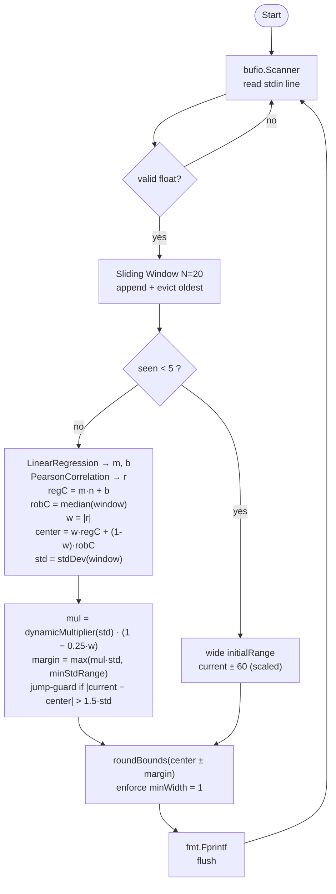

# PRD — Guess It 2

## 1. Problem Statement
**Context:** A real-time prediction engine that operates in a competitive environment, receiving a continuous stream of numbers via standard input.

**Core Function:** For each number received, predict a range `[lower, upper]` where the *next* number will fall. Success is measured by prediction accuracy and range narrowness (smaller correct ranges score higher).

**Differs from guess-it-1 by:**
- Opponent roster: `big-range`, `linear-regr`, `correlation-coef`, plus bonus `mse` and `nic`.
- Datasets: `Data 4` and `Data 5` (harder regimes than guess-it-1's Data 1–3).
- Algorithm: extends the 5-tier StdDev predictor with `LinearRegression` and `PearsonCorrelation` reused from the `linearstats` package (ported from the `linear-stats` project).

**Constraints:**
- Language: Go (Golang).
- Environment: Dockerized testing environment.
- Output: Two space-separated integers per stdin line, flushed immediately.

---

## 2. User / Use Case
**Primary User:** An automated auditor program that also acts as a competitor.

**Use Case:**
1. Read a single number from stdin.
2. Append it to a sliding window of recent data points (oldest evicted on overflow).
3. Run statistical analysis on the window to determine a predictive range.
4. Print `lower upper\n` to stdout, flushed immediately.
5. Repeat until EOF.

---

## 3. CLI Contract

### Execution
```sh
#!/bin/sh
export PREDICT_CENTER="median"
./student/guess-it-2
```

### Input (stdin)
A stream of numbers, one per line. The program processes each number immediately (no buffering until EOF).

### Output (stdout)
For each numeric input, one line: `lower upper`.

---

## 4. Functional Requirements

### 4.1 Data & State Management
- **Streaming Ingestion:** `bufio.Scanner` reads `os.Stdin` line by line.
- **Sliding Window:** Fixed-size window (`N = 20`). On overflow the oldest value is discarded.
- **Robustness:** Non-numeric lines are silently skipped; state is preserved.

### 4.2 Core Logic — Hybrid Predictor

The predictor blends linear-regression extrapolation with the original median + 5-tier model, weighted by the absolute Pearson correlation coefficient.

```
m, b   := LinearRegression(window)
r      := PearsonCorrelation(window)
regC   := m * len(window) + b
robC   := median(window)            # or average if PREDICT_CENTER != "median"
w      := |r|                       # already in [0,1]
center := w*regC + (1-w)*robC
std    := stdDev(window)
mul    := dynamicMultiplier(std) * (1 - 0.25*w)
margin := max(mul*std, minStdRange)
if |current - center| > 1.5*std:
    margin = max(margin, |current - center| * 1.1)   # jump guard
print roundBounds(center - margin, center + margin)
```

**Dynamic multiplier — unchanged 5-tier system:**

| stdDev range     | Multiplier | Label           |
|------------------|------------|-----------------|
| `< 5.0`          | `1.2`      | Very Aggressive |
| `5.0 – 25.0`     | `1.4`      | Aggressive      |
| `25.0 – 40.0`    | `1.8`      | Balanced        |
| `40.0 – 80.0`    | `2.1`      | Defensive       |
| `≥ 80.0`         | `2.4`      | Extreme         |

**Safeguards (unchanged):**
- `minStdRange = 1.8` — minimum margin before rounding.
- `minWidth = 1` — minimum output integer width (`upper ≥ lower + 1`).
- `initialRange = 60.0` — fixed range used while `seen < 5`; scaled by `|current|` for streams that open in the thousands.

### 4.3 Scoring & Winning
- Prediction is successful if the next number falls within `[lower, upper]`.
- Score is inversely proportional to range width.
- **Win condition:** Score higher than the opponent in ≥ 2 of 3 runs per dataset.

---

## 5. Non-Functional Requirements

### 5.1 Performance
- O(N) per iteration over the sliding window (N = 20). `LinearRegression` and `PearsonCorrelation` are also O(N).
- Output flushed after every write; no input/prediction lag.

### 5.2 Packaging & Deployment
- All student code in `student/`.
- Executable `script.sh` at the student folder root is the auditor's entry point.

### 5.3 Reliability
- Invalid (non-numeric) input: ignored, program continues.
- Empty or prematurely closed stream: terminates cleanly, exit 0.
- All internal calculations in `float64`; final bounds rounded to integers.

---

## 6. Acceptance Criteria

### 6.1 Golden Tests

| ID   | Scenario | Expected Behaviour |
|------|----------|--------------------|
| GT01 | 5th input (`103`) after `[100,102,104,101]` | Centre near 102.5; tight range covers 103. |
| GT02 | Linear trend `[100,101,…,119]`, input `120` | Centre ≈ 120 (regression dominates, `\|r\|` ≈ 1); margin shrinks ~25 %. |
| GT03 | Full window of `50`s, input `50` | `48 52` (centre = 50, margin = `minStdRange`). |
| GT04 | Stable window `[100..104]`, spike `500` | Jump-guard widens margin to cover the spike. |
| GT05 | Oscillating `[10,100,10,100,…]`, input `10` | `\|r\| ≈ 0`; centre near median (~55); margin wide enough to cover both. |

### 6.2 Audit Cases

| ID  | Opponent           | Condition |
|-----|--------------------|-----------|
| A01 | `big-range`        | Win ≥ 2/3 runs on Data 4, 5 |
| A02 | `linear-regr`      | Win ≥ 2/3 runs on Data 4, 5 |
| A03 | `correlation-coef` | Win ≥ 2/3 runs on Data 4, 5 |
| A04 | `mse` *(bonus)*    | Win ≥ 2/3 runs on Data 4, 5 |
| A05 | `nic` *(bonus)*    | Win ≥ 2/3 runs on Data 4, 5 |
| A06 | Packaging          | `student/` + executable `script.sh` |

### 6.3 Edge Cases — see `docs/edge_cases.md`.
### 6.4 Hybrid-Predictor Detailed Scenarios — see `docs/golden_tests.md` §3.

---

## 7. Implementation Approach

### 7.1 Architecture — Modular Streaming Pipeline

The codebase is a **single-binary streaming pipeline**. One goroutine reads one line at a time and produces one prediction at a time — each stage is a pure function, the only mutable state is the sliding window, and per-iteration work is `O(N)` with `N = 20`.

```
stdin ─► Ingestor ─► Sliding Window ─► Analyzer ─► Predictor ─► Renderer ─► stdout
        (parse)     (state, evict)   (stats)     (blend+tier)  (round+format)
```

| Stage      | Responsibility |
|------------|----------------|
| Ingestor   | `bufio.Scanner` over `os.Stdin`; trims and parses each line; skips invalid input. |
| Window     | Fixed-size `[]float64` (`N = 20`); appends on arrival, evicts oldest on overflow. |
| Analyzer   | Pure statistical functions over the current window. |
| Predictor  | Blends regression extrapolation with median/average via `\|r\|`, applies tier multiplier scaled by `1 − 0.25·\|r\|`, enforces safeguards. |
| Renderer   | Rounds to integers, enforces `minWidth`, writes `lower upper\n`, flushes immediately. |


**Boundaries & separation of concerns:**
- `main.go` does no statistics; the `linearstats` package does no I/O. Each stage can be unit-tested in isolation against table-driven inputs.
- All shared tuning lives in `linearstats/predict.go` as `const`s — no global mutable state.

### 7.2 System Flowchart



---

## 8. Milestones

| Phase | Goal |
|-------|------|
| 1.  Documentation & Scaffolding | Edge Cases, PRD, tasks/, `.ai/hmim.ai.log`, git bootstrap |
| 2.  Package Rename | `mathskills` → `linearstats`, drop dead `run.go` |
| 3.  Hybrid Predictor | Regression + $\|r\|$ blend; multiplier scaling |
| 4.  Tests & Build | Table-driven coverage ≥ 90 %; Linux binary |

---

## 9. Risks / Open Questions

| Risk | Impact | Mitigation |
|------|--------|------------|
| Regression bias under trend reversals | Medium | The window-size eviction + jump-guard handles short-term reversals; $\|r\|$ drops naturally when the trend breaks. |
| Multiplier shrink too aggressive at $\|r\|≈1$ | Medium | The `0.25` scaling factor leaves a 75 % floor; tunable. |
| `correlation-coef` opponent more aggressive than expected | Medium | The $(1 − 0.25·\|r\|)$ rule mirrors its likely strategy; iterate the coefficient if benchmarks slip. |
| Packaging | High | `student/guess-it-2` binary + executable `script.sh` rebuilt each refactor. |
